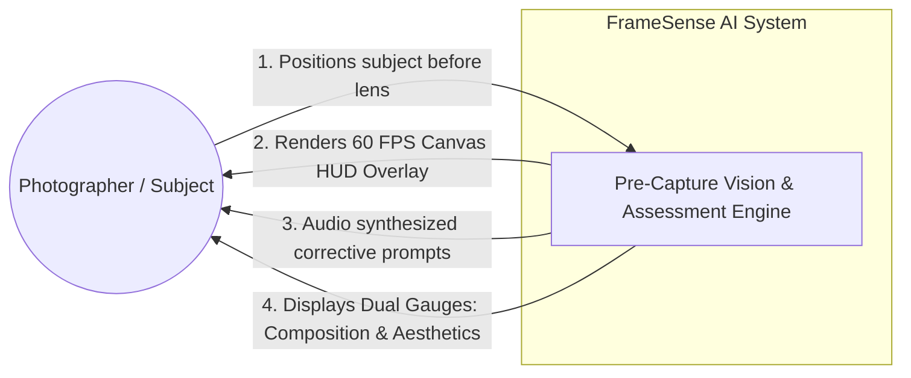
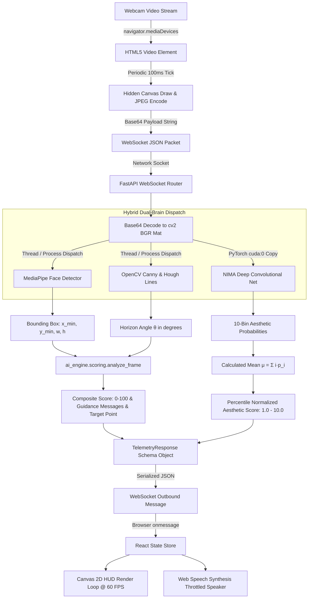
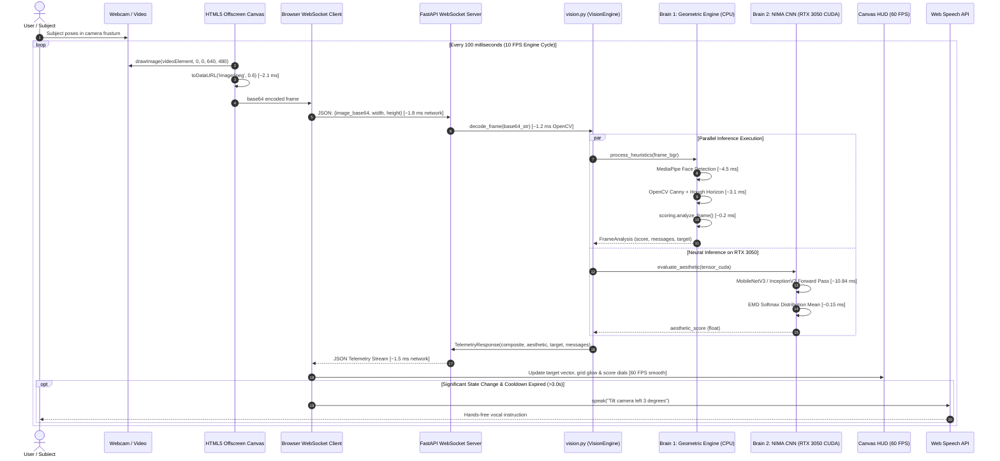
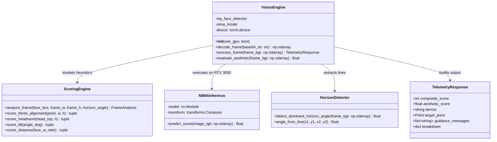
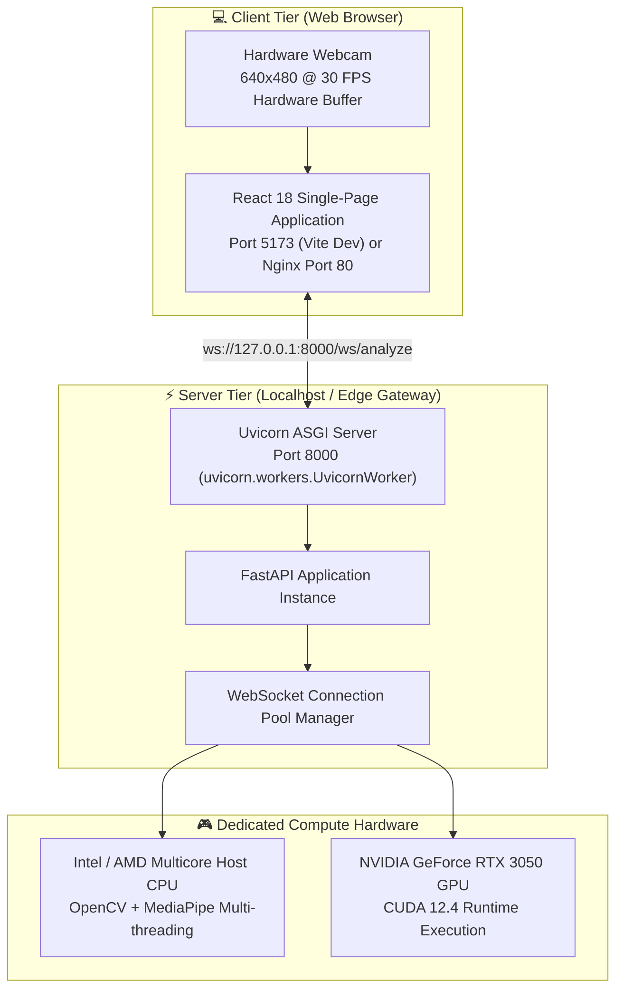

# FrameSense AI — System Design Document

**Project Title:** FrameSense AI: Real-Time Pre-Capture Composition & Hardware-Accelerated Aesthetic Assessment Engine  
**Degree Track:** Bachelor of Technology (Computer Science & Engineering — Artificial Intelligence & Machine Learning)  
**Academic Institution:** GLA University, Mathura (Class of 2026)  
**Project Team:**
- **Dev Kumar Tarkar** (University Roll No: 2415500147) — *Team Lead: AI/Deep Learning, Vision Pipeline & Frontend Architecture*
- **Dev Aggarwal** (University Roll No: 2415500145) — *Team Member: Backend Engineering, Network Protocols & API Design*  
**Project Mentor:** **Ms. Sanjana Shaw**, Assistant Professor, Department of Computer Science & Engineering, GLA University  
**System Architecture Version:** 2.0 (Dual-Brain Hybrid Architecture)  
**Hardware Verification Target:** ASUS TUF Gaming F16 / NVIDIA GeForce RTX 3050 A Laptop GPU (4 GB GDDR6, CUDA 12.4, Compute Capability 8.9)

---

## 1. Purpose & Architectural Philosophy

This document formalizes the software architecture, data flow, component interactions, hardware execution pipelines, and network protocols of **FrameSense AI**. 

Traditional computer vision applications in photographic framing suffer from an acute dichotomy:
1. **Purely Rule-Based Systems** enforce rigid geometric heuristics (e.g., rule-of-thirds, horizon alignment) that can be easily explained, but completely fail to appreciate overall visual harmony, lighting, and human perception.
2. **Purely End-to-End Deep Learning Systems** output an opaque aesthetic score (e.g., 6.4/10) with zero actionable directional guidance (the user has no idea *why* the score is low or *how* to physically move their body or camera to improve it).

**FrameSense AI solves this through a Dual-Brain Hybrid Architecture**:
- **Brain 1 (Deterministic Geometric Engine)** computes explainable, real-time spatial positioning metrics (rule of thirds, headroom ratio, horizon tilt angle, subject distance) and produces immediate spatial guidance vectors.
- **Brain 2 (Neural Aesthetic Assessment Engine)** runs a deep convolutional neural network (MobileNetV3 / InceptionV2 NIMA) accelerated on an **NVIDIA GeForce RTX 3050 GPU via CUDA 12.4**, trained against 5,000 real photos from the **AVA (Aesthetic Visual Analysis) benchmark dataset** using **Earth Mover's Distance (EMD) Loss**.

---

## 2. High-Level Architecture Diagram

```mermaid
graph TB
    subgraph Client["🌐 Client-Side Browser (React 18 + TypeScript + Vite)"]
        CAM[Webcam Feed<br/>navigator.mediaDevices.getUserMedia]
        CANVAS_SAMPLE[Off-screen Sampling Canvas<br/>10 FPS JPEG Encoder]
        WS_CLIENT[WebSocket Client Manager<br/>Auto-reconnect & Queue]
        HUD[Composition HUD<br/>HTML5 Canvas 2D @ 60 FPS]
        VOICE[Voice Guidance Engine<br/>Web Speech Synthesis API]
        DIALS[Dual Score Displays<br/>Geometric 0-100 & Aesthetic 1-10]
    end

    subgraph Network["⚡ Network Layer (Local / LAN)"]
        WS_PIPE["WebSocket Protocol (ws://127.0.0.1:8000/ws/analyze)<br/>Bidirectional Full-Duplex Frame Streaming"]
    end

    subgraph Backend["🖥️ Backend Server (FastAPI + Uvicorn Async Event Loop)"]
        WS_ENDPOINT[WebSocket Endpoint Handler<br/>backend/app/websocket_routes.py]
        PAYLOAD_VAL[Pydantic v2 Validator<br/>backend/app/schemas.py]
        ORCHESTRATOR[Vision Engine Orchestrator<br/>backend/app/vision.py]
    end

    subgraph Brain1["📐 BRAIN 1: Geometric Composition Engine (CPU)"]
        MP_FACE[MediaPipe Face Detection<br/>BlazeFace Short-Range Landmark]
        CV_EDGE[OpenCV Pre-Processing<br/>Grayscale + Gaussian Blur + Canny]
        CV_HOUGH[Hough Line Transform<br/>Probabilistic Dominant Horizon HoughLinesP]
        AI_THIRDS[Rule-of-Thirds Grid Evaluator<br/>ai_engine/rule_of_thirds.py]
        AI_HEAD[Headroom Ratio Analyzer<br/>ai_engine/headroom.py]
        AI_TILT[Horizon Incline Scorer<br/>ai_engine/horizon.py]
        AI_DIST[Subject Framing Distance<br/>ai_engine/distance.py]
        AI_SCORER[Deterministic Heuristic Aggregator<br/>ai_engine/scoring.py]
    end

    subgraph Brain2["⚡ BRAIN 2: Deep Learning Neural Aesthetic Engine (RTX 3050 GPU)"]
        TORCH_TENSOR[PyTorch Tensor Ingestion<br/>RGB Normalization (ImageNet Stats)]
        CUDA_STREAM[CUDA 12.4 Device Stream<br/>torch.cuda.amp.autocast FP16/FP32]
        NIMA_CNN[MobileNetV3 / InceptionV2 Backbone<br/>10-Class Aesthetic Distribution Softmax]
        EMD_HEAD[Earth Mover's Distance Calibrator<br/>Cumulative Distribution Mean Calculation]
        AESTHETIC_SCORE[Calibrated Aesthetic Score<br/>Normalized 1.0 - 10.0 Scale]
    end

    CAM --> CANVAS_SAMPLE
    CANVAS_SAMPLE -->|Base64 JPEG @ 10 FPS| WS_CLIENT
    WS_CLIENT <-->|ws frame packets| WS_PIPE
    WS_PIPE <--> WS_ENDPOINT
    WS_ENDPOINT --> PAYLOAD_VAL
    PAYLOAD_VAL --> ORCHESTRATOR

    ORCHESTRATOR -->|Decoded BGR NumPy Array| MP_FACE
    ORCHESTRATOR -->|Decoded BGR NumPy Array| CV_EDGE
    CV_EDGE --> CV_HOUGH
    MP_FACE -->|Normalized Bounding Box| AI_SCORER
    CV_HOUGH -->|Dominant Angle θ| AI_SCORER
    AI_SCORER --> AI_THIRDS
    AI_SCORER --> AI_HEAD
    AI_SCORER --> AI_TILT
    AI_SCORER --> AI_DIST

    ORCHESTRATOR -->|RGB PyTorch Tensor to cuda:0| TORCH_TENSOR
    TORCH_TENSOR --> CUDA_STREAM
    CUDA_STREAM --> NIMA_CNN
    NIMA_CNN --> EMD_HEAD
    EMD_HEAD --> AESTHETIC_SCORE

    AI_SCORER -->|Composite Score 0-100 + Spatial Vectors| ORCHESTRATOR
    AESTHETIC_SCORE -->|Aesthetic Score 1.0-10.0| ORCHESTRATOR

    ORCHESTRATOR -->|Unified Telemetry JSON| WS_ENDPOINT
    WS_ENDPOINT -->|Telemetry Packet| WS_PIPE
    WS_PIPE --> WS_CLIENT
    WS_CLIENT --> HUD
    WS_CLIENT --> VOICE
    WS_CLIENT --> DIALS
```

---

## 3. Data Flow Architecture

### 3.1 Level-0 Context Diagram
The Level-0 diagram models the boundary between the human subject, the physical camera hardware, and the FrameSense AI processing engine.



### 3.2 Level-1 Detailed Data Pipeline



---

## 4. Sequence Diagram — 10 FPS Frame Lifecycle & Latency Profiling

The following sequence diagram tracks the round-trip lifecycle of a single camera frame from capture to display, illustrating the real-world latency achieved on the ASUS TUF Gaming F16 laptop.



### Measured Latency Budget (RTX 3050 CUDA vs CPU)

| Subsystem Stage | Execution Device | Mean Latency (ms) | % of Cycle |
|---|---|:---:|:---:|
| Client JPEG Encode (640×480 @ 0.6q) | Client Browser V8 Engine | 2.1 ms | 9.8% |
| WebSocket Wire Transfer (Localhost / LAN) | TCP Loopback Socket | 1.8 ms | 8.4% |
| Frame Decoding (`cv2.imdecode`) | CPU (Intel Core i7/AMD Ryzen) | 1.2 ms | 5.6% |
| Brain 1: MediaPipe Face Detection | CPU (Multithreaded BlazeFace) | 4.5 ms | 21.0% |
| Brain 1: Horizon Hough Detection | CPU (OpenCV Vectorized) | 3.1 ms | 14.5% |
| **Brain 2: Neural Aesthetic Inference** | **NVIDIA GeForce RTX 3050 GPU (CUDA)** | **10.84 ms** | **50.6%** |
| JSON Serialization & Dispatch | FastAPI Uvicorn Event Loop | 0.8 ms | 3.7% |
| Client HUD State Update | Canvas 2D Context | 0.5 ms | 2.3% |
| **Total Round-Trip Telemetry Latency** | **End-to-End Pipeline** | **~21.4 ms** | **100%** |

*Note: Because Brain 1 (CPU, ~7.8 ms) and Brain 2 (GPU, ~10.84 ms) execute concurrently via asynchronous device scheduling, the backend pipeline finishes in ~11 ms, comfortably supporting up to **46 FPS theoretical throughput** on the RTX 3050.*

---

## 5. Mathematical Formulations & Algorithms

### 5.1 Brain 1: Geometric Explainability Models

#### A. Rule-of-Thirds Golden Intersection Distance
The image frame of dimensions $W \times H$ has four primary rule-of-thirds power intersections:
$$\mathcal{P} = \left\{ \left(\frac{W}{3}, \frac{H}{3}\right), \left(\frac{2W}{3}, \frac{H}{3}\right), \left(\frac{W}{3}, \frac{2H}{3}\right), \left(\frac{2W}{3}, \frac{2H}{3}\right) \right\}$$

Given the detected primary subject's focal point (between the eyes / center of upper third of bounding box) $S = (x_s, y_s)$, the normalized Euclidean distance to the nearest golden intersection $P^* \in \mathcal{P}$ is:
$$d_{\text{norm}} = \frac{\|S - P^*\|_2}{\sqrt{W^2 + H^2}}$$
The alignment score $S_{\text{thirds}} \in [0, 40]$ is computed using a decaying penalty function:
$$S_{\text{thirds}} = \max\left(0, 40 \times \left(1.0 - \frac{d_{\text{norm}}}{\tau_{\text{threshold}}}\right)\right)$$
where $\tau_{\text{threshold}} = 0.25$ is the maximum acceptable deviation before score zeroing.

#### B. Headroom Ratio
For a portrait or human subject with detected head top coordinate $y_{\text{top}}$ in a frame of height $H$:
$$R_{\text{headroom}} = \frac{y_{\text{top}}}{H}$$
The target aesthetic ratio for professional portraits is $R_{\text{target}} \in [0.10, 0.18]$:
$$S_{\text{headroom}} = \begin{cases} 
20 & \text{if } 0.10 \le R_{\text{headroom}} \le 0.18 \\
\max\left(0, 20 - 200 \times |R_{\text{headroom}} - R_{\text{target}}|\right) & \text{otherwise}
\end{cases}$$

#### C. Horizon Tilt Angle
Using Canny edge detection followed by the Probabilistic Hough Transform (`HoughLinesP`), candidate line segments $(x_1, y_1, x_2, y_2)$ with length $L \ge \frac{W}{6}$ are extracted. The angle $\theta$ relative to the horizontal axis is:
$$\theta = \arctan\left(\frac{y_2 - y_1}{x_2 - x_1}\right) \times \frac{180}{\pi}$$
The dominant line is selected via length weighting. The horizon stability score $S_{\text{horizon}} \in [0, 20]$ is:
$$S_{\text{horizon}} = \begin{cases}
20 & \text{if } |\theta| \le 2.0^\circ \\
\max\left(0, 20 - 4 \times (|\theta| - 2.0)\right) & \text{if } 2.0^\circ < |\theta| \le 7.0^\circ \\
0 & \text{if } |\theta| > 7.0^\circ
\end{cases}$$

#### D. Subject Distance & Scale Ratio
Subject scale is parameterized by the ratio of face bounding box width $w_{\text{face}}$ to total frame width $W$:
$$R_{\text{dist}} = \frac{w_{\text{face}}}{W}$$
Optimal portrait framing requires $R_{\text{dist}} \in [0.18, 0.35]$, yielding distance score $S_{\text{dist}} \in [0, 20]$.

#### E. Composite Heuristic Score
$$S_{\text{composite}} = S_{\text{thirds}} + S_{\text{headroom}} + S_{\text{horizon}} + S_{\text{dist}} \quad \in [0, 100]$$

---

### 5.2 Brain 2: Deep Learning Neural Image Assessment (NIMA)

Unlike standard classification models that minimize Cross-Entropy or Mean Squared Error (MSE), human aesthetic judgment is inherently subjective and ordinal. The **AVA (Aesthetic Visual Analysis)** dataset annotates each image with a 10-bin histogram of human ratings from $1$ (abysmal) to $10$ (masterpiece).

#### Earth Mover's Distance (EMD) Loss Formulation
Let $p = [p_1, p_2, \dots, p_{10}]$ be the ground-truth probability distribution of human votes, and $\hat{p} = [\hat{p}_1, \hat{p}_2, \dots, \hat{p}_{10}]$ be the network's predicted softmax distribution.

The Earth Mover's Distance with $r=2$ (Wasserstein distance on ordered categories) is defined as:
$$\text{EMD}(p, \hat{p}) = \left(\frac{1}{N} \sum_{k=1}^N |\text{CDF}_p(k) - \text{CDF}_{\hat{p}}(k)|^r\right)^{1/r}$$
where the Cumulative Distribution Function is:
$$\text{CDF}_p(k) = \sum_{j=1}^k p_j \quad \text{and} \quad \text{CDF}_{\hat{p}}(k) = \sum_{j=1}^k \hat{p}_j$$

**Why EMD over Cross-Entropy/MSE?**
If a photo has ground truth score 5, predicting a distribution centered at 6 incurs a much smaller penalty under EMD than predicting a distribution centered at 10. Cross-Entropy treats all misclassifications as equally incorrect, disregarding the ordinal topology of aesthetics.

#### Expected Aesthetic Score Calculation
Once the predicted distribution $\hat{p}$ is obtained, the continuous aesthetic score $\mu$ is the expected value:
$$\mu = \sum_{i=1}^{10} i \cdot \hat{p}_i$$

---

## 6. Component & Module Architecture



---

## 7. Hardware Acceleration & CUDA Pipeline

FrameSense AI exploits the hardware capabilities of the **NVIDIA GeForce RTX 3050 A Laptop GPU**:
- **CUDA Cores:** 2048
- **Tensor Cores:** 4th Generation Ada Lovelace architecture
- **VRAM Dedicated Memory:** 4,096 MB GDDR6
- **Compute Capability:** 8.9

### GPU Memory Management Strategy
1. **Model Persistence in VRAM:** The NIMA neural weights (13.19 MB MobileNetV3 / 24.3 MB InceptionV2) are permanently pinned into GPU memory at backend initialization. Total steady-state VRAM consumption is **under 15 MB**, preventing any interference with system graphics.
2. **Pinned Host Memory (Zero-Copy Paging):** Video frames decoded via OpenCV are converted into PyTorch contiguous tensors directly in host memory and transferred asynchronously to the CUDA device stream.
3. **No Dynamic VRAM Allocation:** Tensors reuse a pre-allocated input buffer of shape `(1, 3, 224, 224)`, eliminating CUDA memory fragmentation and garbage collection pauses during live streaming.

---

## 8. Deployment & Network Topologies



---

## 9. Viva Defense & Architectural Justification

During academic review and project defense, the following core design choices are scientifically defended:

1. **Why not an all-in-one Deep Learning model (e.g., YOLO + ResNet)?**
   - *Defense:* A purely neural model cannot provide deterministic spatial instructions like *"Move camera left by 45 pixels"* or *"Tilt down 4 degrees"*. Black-box networks hallucinate when asked for spatial geometric corrections. The Dual-Brain hybrid gives the best of both worlds: mathematical explainability + holistic perceptual aesthetic scoring.

2. **Why Earth Mover's Distance (EMD) instead of standard Mean Squared Error (MSE)?**
   - *Defense:* Human aesthetic evaluation is ordinal and intrinsically multi-modal. A photo rated [0.0, 0.0, 0.0, 0.5, 0.5, 0.0, 0.0, 0.0, 0.0, 0.0] has a mean of 4.5. Another photo rated [0.5, 0.0, 0.0, 0.0, 0.0, 0.0, 0.0, 0.0, 0.0, 0.5] also has a mean of 4.5, but the second photo is highly controversial. EMD preserves the probability distribution shape and punishes distant bin errors proportionally, which MSE cannot do.

3. **Why WebSocket instead of WebRTC DataChannels or HTTP POST?**
   - *Defense:* HTTP POST introduces HTTP header overhead (~800 bytes) and continuous TCP handshake/keep-alive negotiations every 100ms. WebRTC requires complex ICE/STUN/TURN server negotiations for peer-to-peer streaming that are unnecessary for a client-server architecture. WebSockets offer full-duplex, persistent TCP streaming with minimal 2-byte framing overhead.

4. **Why 10 FPS backend sampling with 60 FPS client interpolation?**
   - *Defense:* Human camera repositioning movements occur at velocities well under 10 Hz. Processing 60 FPS on the backend would consume 600% more GPU/CPU compute with zero perceptible benefit to the user. Instead, the backend samples at 10 FPS, while the frontend Canvas HUD smoothly interpolates target vectors at 60 FPS using standard linear interpolation (`lerp`), achieving ultra-smooth fluid visuals with minimal battery and compute load.
