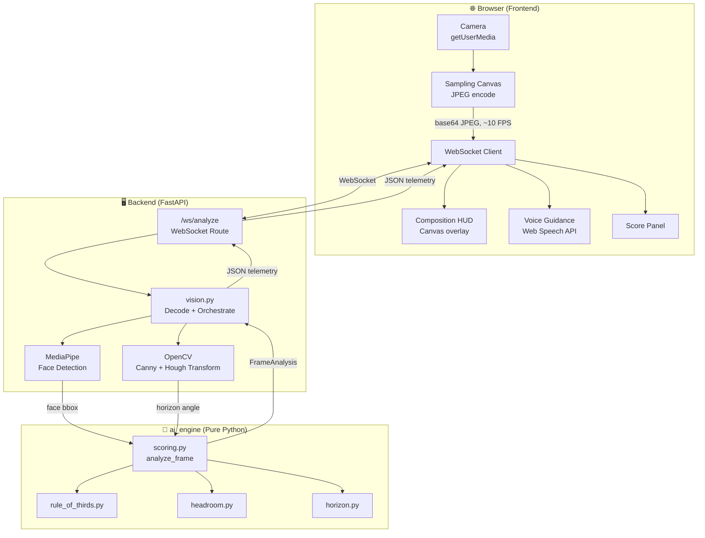
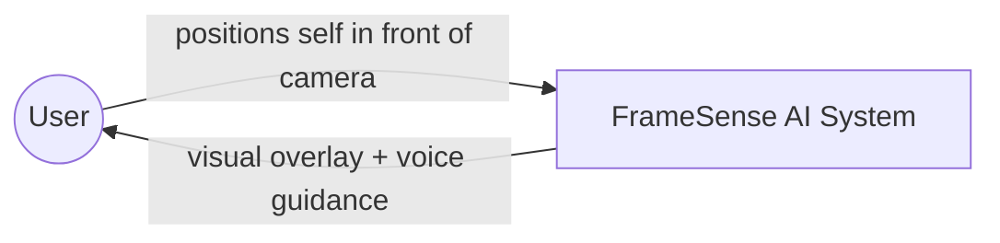
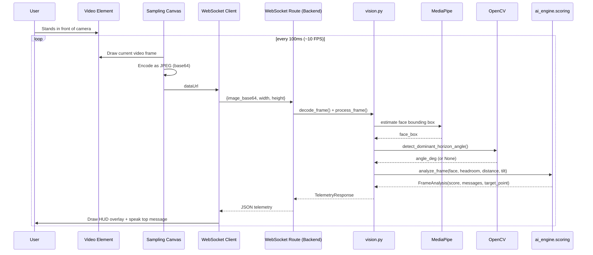
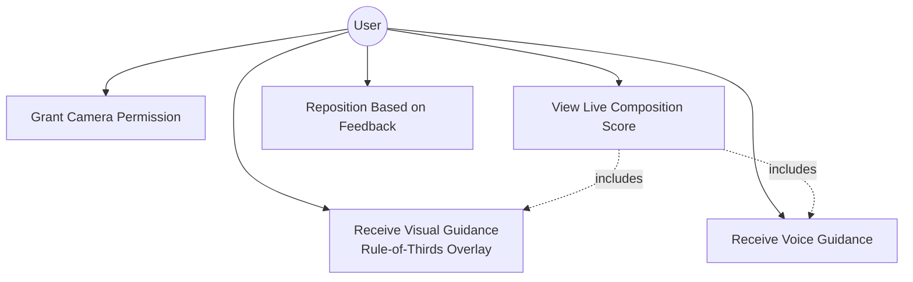
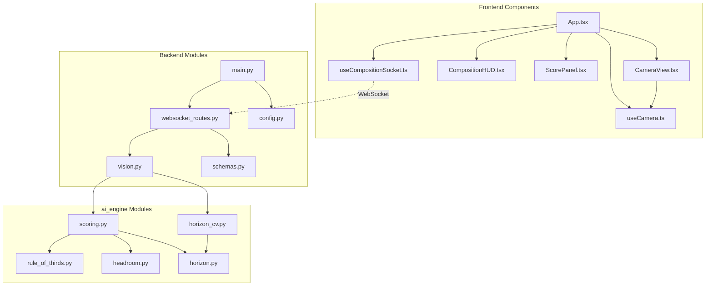
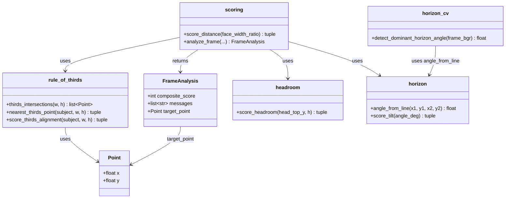
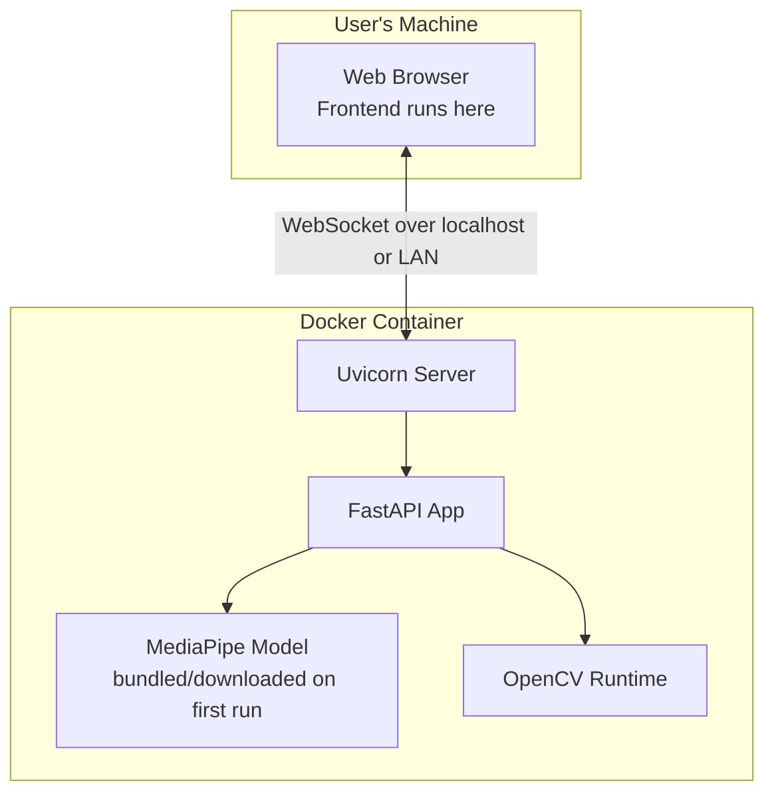

# FrameSense AI — System Design Document

**Project:** FrameSense AI (Real-Time Pre-Capture Composition Assistant)
**Version:** 1.0

> All diagrams below use Mermaid syntax. They render natively in GitHub,
> VS Code (with the Mermaid extension), Antigravity, and most modern
> Markdown viewers. If your college wants image-based diagrams for the
> printed report, open this file in such a viewer and export each diagram
> as PNG/SVG.

---

## 1. Purpose

This document describes FrameSense AI's system architecture, data flow,
and component interactions at a level of detail sufficient to implement,
review, and defend the design in a viva. It complements the PRD (which
covers *what* is being built) by focusing on *how* the pieces fit together.

Note: FrameSense AI has **no persistent database** in v1 (every frame is
processed and discarded in real time, nothing is stored) — so no ER diagram
is included. If a "saved shots history" feature is added later, an ER
diagram would be added at that point.

---

## 2. High-Level Architecture Diagram

---

## 3. Data Flow Diagram

### 3.1 Level 0 — Context Diagram

### 3.2 Level 1 — Detailed Data Flow

```mermaid
flowchart LR
    A[User's Live Video Feed] -->|Process 1:<br/>Capture & Sample Frame| B[Sampled JPEG Frame]
    B -->|Process 2:<br/>Transmit via WebSocket| C[Raw Frame on Backend]
    C -->|Process 3:<br/>Decode Image| D[Pixel Array]
    D -->|Process 4:<br/>Detect Face| E[Face Bounding Box]
    D -->|Process 5:<br/>Detect Horizon| F[Horizon Angle]
    E -->|Process 6:<br/>Score Composition| G[Composite Score +<br/>Guidance Messages]
    F --> G
    G -->|Process 7:<br/>Send Telemetry| H[JSON Response]
    H -->|Process 8:<br/>Render Overlay| I[HUD on Screen]
    H -->|Process 9:<br/>Speak Message| J[Audio Output]
```

---

## 4. Sequence Diagram — One Frame's Journey

---

## 5. Use Case Diagram

---

## 6. Component / Module Diagram

---

## 7. Class-Level Design — `ai_engine`

---

## 8. Deployment Diagram

---

## 9. Design Notes Worth Mentioning in the Report/Viva

- **Why a sequence diagram matters here:** the ~10 FPS backend sampling vs.
  ~60 FPS frontend HUD rendering is a deliberate performance decision — the
  sequence diagram makes that timing explicit rather than hidden in code.
- **Why the component diagram shows `ai_engine` fully isolated:** no arrow
  points *into* `ai_engine` from `backend` except through `scoring.py` and
  `horizon_cv.py` — everything else in `ai_engine` has zero inbound
  framework dependency, which is what makes it unit-testable in isolation.
- **No ER diagram** because v1 has no persistence layer — this is a
  deliberate scope decision (see PRD §9, Future Enhancements) and should be
  stated as such if a reviewer asks why there's no database.
